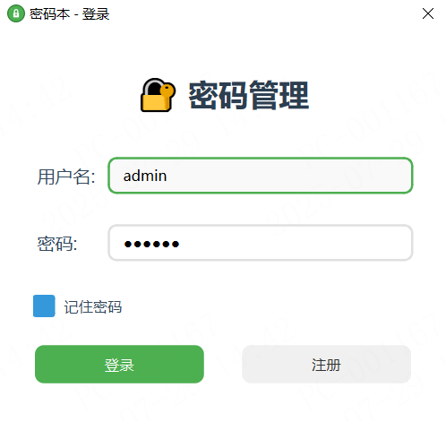
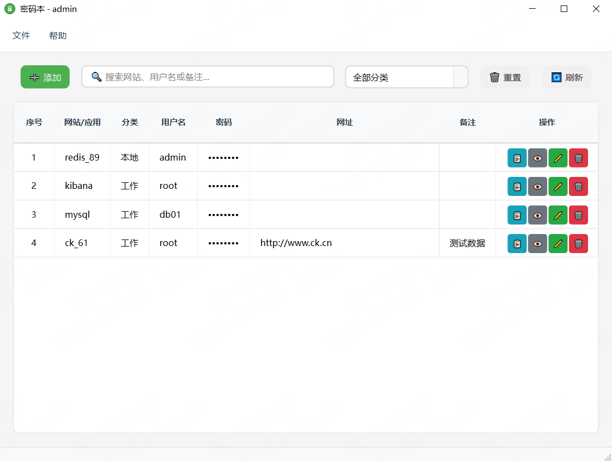
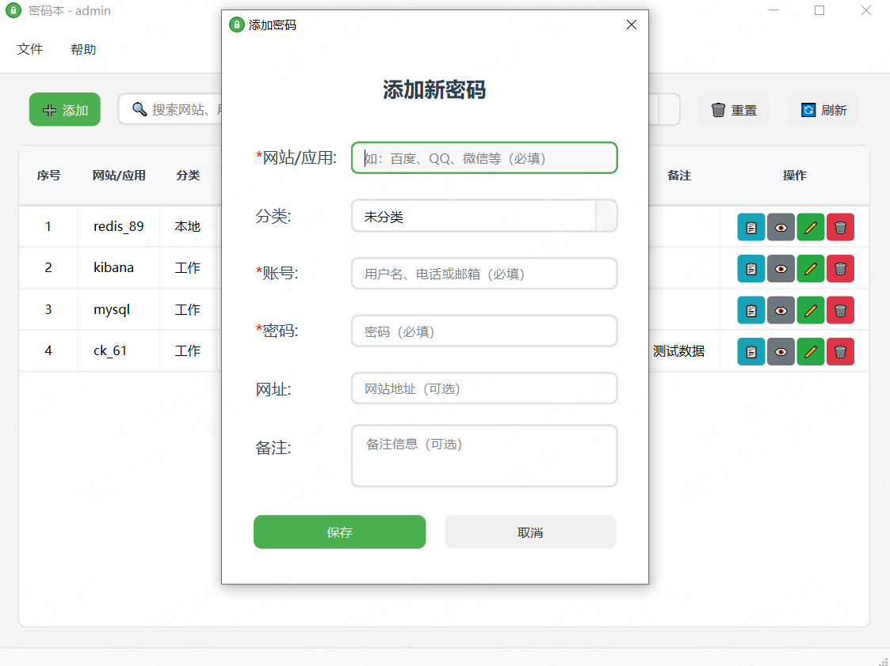

# 🔐 密码本 (SecretBook)

一个简单、安全、易用的本地密码管理工具，界面简洁，ui美观。


## 📸 界面截图

### 登录界面


### 主界面


### 添加密码


## ✨ 功能特点

- 🔒 **本地加密存储** - 所有密码数据都在本地加密保存，确保隐私安全
- 👤 **多用户支持** - 支持多个用户账户，每个用户的数据完全隔离
- 🔍 **智能搜索** - 支持按网站、用户名、备注等字段快速搜索
- 📂 **分类管理** - 支持密码分类，便于组织和管理
- 👁️ **安全查看** - 密码默认隐藏，点击查看时临时显示
- 📋 **一键复制** - 快速复制密码到剪贴板
- 📤 **导入导出** - 支持密码数据的备份和恢复
- 🎨 **现代界面** - 简洁美观的用户界面，支持深色主题

## 🚀 快速开始

### 环境要求

- Python 3.8+
- PySide6
- cryptography

### 安装依赖

```bash
pip install PySide6 cryptography
```

### 运行应用

```bash
python main.py
```

## 📁 项目结构
SecretBook/
├── assets/                 # 资源文件
│   └── logo.svg           # 应用图标
├── ui/                    # 用户界面
│   ├── components/        # UI组件
│   │   ├── menu_manager.py
│   │   ├── password_table.py
│   │   └── toolbar.py
│   ├── handlers/          # 业务逻辑处理器
│   │   ├── import_export_handler.py
│   │   └── password_handler.py
│   ├── login_dialog.py    # 登录对话框
│   ├── main_window.py     # 主窗口
│   └── password_dialog.py # 密码编辑对话框
├── utils/                 # 工具模块
│   ├── crypto.py          # 加密解密
│   ├── data_manager.py    # 数据管理
│   └── styles.py          # 样式管理
├── main.py               # 应用入口
└── README.md             # 项目说明


## 🔧 主要功能

### 用户管理
- 用户注册和登录
- 密码验证和会话管理
- 安全注销功能

### 密码管理
- 添加、编辑、删除密码记录
- 密码字段包括：网站/应用、用户名、密码、网址、分类、备注
- 支持密码强度检查和生成建议

### 数据安全
- 使用 AES 加密算法保护数据
- 基于用户密码的密钥派生
- 本地存储，不依赖云服务

### 用户体验
- 直观的图形界面
- 快捷键支持
- 状态提示和错误处理
- 响应式布局设计

## 🛡️ 安全特性

1. **端到端加密** - 数据在存储前就已加密
2. **密钥派生** - 使用 PBKDF2 从用户密码派生加密密钥
3. **本地存储** - 所有数据都保存在本地，不上传到任何服务器
4. **会话管理** - 自动注销和会话超时保护
5. **密码隐藏** - 界面中的密码默认隐藏显示

## 📝 使用说明

1. **首次使用**：运行程序后创建新用户账户
2. **登录**：使用用户名和密码登录
3. **添加密码**：点击"添加密码"按钮，填写相关信息
4. **查看密码**：点击表格中的"查看"按钮临时显示密码
5. **复制密码**：点击"复制"按钮将密码复制到剪贴板
6. **搜索过滤**：使用搜索框或分类下拉框过滤密码
7. **导出备份**：通过菜单导出密码数据进行备份

## 🔄 版本历史

### v1.0.0
- 基础密码管理功能
- 用户账户系统
- 加密存储
- 搜索和分类功能
- 导入导出功能

## 🤝 贡献

欢迎提交 Issue 和 Pull Request 来改进这个项目。

## 📄 许可证

本项目采用 MIT 许可证。详见 [LICENSE](LICENSE) 文件。

## ⚠️ 免责声明

本软件仅供学习和个人使用。请确保定期备份您的密码数据，开发者不对数据丢失承担责任。

## 📞 联系方式

如有问题或建议，请通过以下方式联系：

- 提交 GitHub Issue
- 发送邮件至开发者

---

**记住：安全的密码管理是数字生活的基础！** 🔐

## 打包
```shell
pip install pyinstaller
python -m PyInstaller --onefile --icon=assets/app.ico --windowed main.py
```
